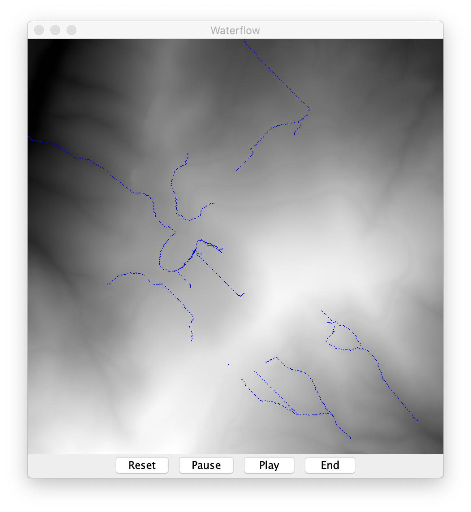
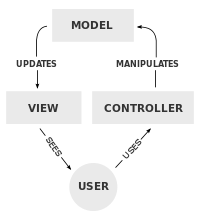

# Concurrent Programming: River Flow Simulation: A2

**Objective**: Design and implement a multithreaded Java _Water Flow Simulator_ that shows how water on a terrain flows downhill, accumulating in basins and flowing off the edge of the terrain. Ensure both thread safety and sufficient concurrency for it to function well.

   
   _Figure 1: The main GUI window for the water flows simulator._
   
### Project Scope

    1. The User Interface to display the results of this simuLation should have the following behaviour:

      - A main display window that shows the landscape as a greyscale image with black representing the lowest elevation and white the highest.
        Overlaid on this should be an image representing the locations of water in blue. Note that although the water will have a depth, 
        represented as an integer value, the colouring is the same uniform blue for any depth value greater than zero.

      - A counter that displays the number of timesteps since the start of simulation (not shown in Fig. 1)
   
      - A 'reset' button that zeroes both the water depth across the entire landscape and the timestep count.

      - A 'pause' button that temporarily stops the simulation.

      - A 'play' button that either starts the simulation or allows it to continue running if it was previously paused.

      - Mouse input that allows the user to click on the display to add a square of the  simulation at the corresponding 
        position on the terrain, irrespective of whether the simulation is currently running or not.
    
    2. Your simulation should be carried out by 4 threads, each responsible for a portion of the permuted list of grid 
       positions. These should synchronise on each timestep. That is, no thread should be allowed to start the next 
       timestep of simulation before all others are complete. For correctness, your program should exhibit "fluid conservation"
       Water can only be created through user mouse input and destroyed by reaching the boundary. The simulation itself is only
       responsible for moving water over the terrain.

    3. Your are provided with skeleton code. When executed, this skeleton provides an incomplete GUI interface with none of the
       buttons. It will display the underlying terrain buit does not include any simulation or display of the overlaying water.
       You must build on the skeleton, improving, adding threading and ensuring threading and ensuring thread safety when 
       necessary. You must use appropriate synchronization and your solution should allow for maximal concurrency: operations 
       should not be serialized unless necessary.

**Requirements**:
1. Input

   Your program must take a single command-line parameter: <input_file>
   This encodes data for the landscape.

2. Controls

   Your program needs to have a **reset**, **pause**, **play**, and **end** button to control the state of the simulation. There also needs to be a display of the current timestep. None of this functionality is available in the skeleton.

3. Output

   The GUI needs to display the results of the simulation as it occurs. Ideally, the rendering of the landscape and water should occur at a faster rate than the simulation to ensure that none of the detail is missed by the user.

4. Code Architecture

   When extending the code, you are expected to follow the _Model-View-Controller_ pattern (shown in Fig. 3) for user interfaces. This very common pattern for software architecture separates the internal representation of the information from the display of the information to the user.

............................................................... ..............................................................
      
   _Fig. 3: The Model-View-Controller pattern has a clear separation between th display of the information (model) and its internal representation._

In this case, the Model comprises the classes such as _Terrain_. The view is the _GUI_ and the controllers will be the _threads_ that you add to alter the model and view, such as the simulation engine.